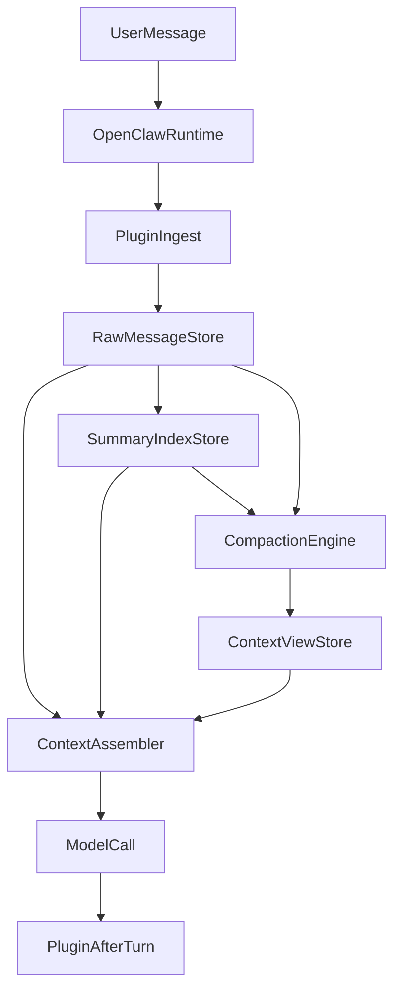

# OpenClaw Lossless 轻量版上下文插件方案

> 最终收敛版：以 2026-03-17 讨论结论为准
> 本文是当前唯一有效方案。早期的“三层记忆 / Hybrid Retrieval / Reranker / GraphRAG”完整设想不再作为首版主线，只保留为远期增强方向。

---

## 1 阅读导航

如果你只关心当前实际要做什么，按下面顺序阅读：

1. `2 最终结论`
2. `3 OpenClaw 原版能力与文件分工`
3. `4 当前方案定位`
4. `5 首版目标与非目标`
5. `6 与 OpenClaw 原版的职责边界`
6. `7 插件目录、挂载方式与启动关系`
7. `8 首版内部架构与生命周期`
8. `9 首版范围清单`（含 `9.4 开发里程碑` 的全部小步骤任务）

说明：

- `10 三方案对比` 是做架构取舍用的对比表
- `11 风险与验证` 是后续评估和 A/B 测试用
- `12 远期增强方向` 不属于首版范围

---

## 2 最终结论

截至目前，方案已经收敛为以下结论：

1. 日常主力环境使用 **一键部署版 OpenClaw**。
2. 方案以 **第三方插件** 落地，不改 OpenClaw Core，不长期维护私有 Fork。
3. 插件只替换 **`contextEngine`**，不替换官方 **`memory-core`**。
4. 当前方案不再定义为“三层记忆版”，而定义为 **Lossless 轻量版上下文插件**。
5. 原始消息是唯一真相源；摘要和当前上下文都属于派生层。
6. 首版目标不是做最强系统，而是：保留大部分 `lossless` 核心效果，同时显著降低主 prompt token。
7. 首版不做向量数据库、Reranker、深层 DAG 自动凝练、子代理 expand、GraphRAG、独立 Sidecar。
8. 首版直接按 `contextEngine` 生命周期落地：`bootstrap / ingest / assemble / compact / afterTurn`。

---

## 3 OpenClaw 原版能力与文件分工

### 3.1 原版已经具备的基础能力

根据官方文档，到 2026-03-17 为止，OpenClaw 原版已经具备：

- `memory-core` 默认记忆插件
- `memory_get`
- `memory_search`
- compaction 前的 `memory flush`
- Markdown 文件型长期记忆体系
- `memory` slot 与 `contextEngine` slot
- 可选的 `QMD` 会话/记忆检索增强
- 原版子代理机制

这意味着：

**你的插件不是从零重做记忆系统，而是在原版已有能力之上增强长会话上下文管理。**

### 3.2 工作区文件分工

| 文件 | 作用 | 是否每轮自动注入 |
|------|------|------------------|
| `SOUL.md` | AI 的人格、语气、边界 | 是 |
| `IDENTITY.md` | AI 的名字、风格、身份感 | 是 |
| `USER.md` | AI 对用户的了解，如称呼、时区、偏好、项目 | 是 |
| `MEMORY.md` | 长期耐久记忆，适合放偏好、决策、事实 | 是 |
| `memory/YYYY-MM-DD.md` | 日常记忆日志、运行中的上下文记录 | 否 |

### 3.3 官方 memory 检索范围

标准 `memory_search` / `memory_get` 的主对象是：

- `MEMORY.md`
- `memory/**/*.md`

也就是说：

- `USER.md` / `SOUL.md` / `IDENTITY.md` 更像常驻 persona / bootstrap 文件
- `MEMORY.md` 与 `memory/YYYY-MM-DD.md` 才是官方 memory 检索体系的核心语料

### 3.4 对当前方案的意义

因此当前插件应采用这条协同关系：

- 原版继续负责 `USER.md` / `SOUL.md` / `IDENTITY.md` / `MEMORY.md` 注入
- 原版继续保留 `memory-core` 与 `memory_search`
- 插件额外增强 **session transcript 级别的无损上下文管理**

---

## 4 当前方案定位

### 4.1 当前方案不再叫“三层记忆版”

当前版本已经不再以“L1/L2/L3 三层记忆结构”作为首版主架构。  
更准确的定义是：

**轻量无损上下文管理插件（Lightweight Lossless Context Plugin）**

### 4.2 当前方案的 3 类核心数据对象

| 对象 | 定位 |
|------|------|
| `Raw Store` | 唯一真相源，永久保存全部原始消息 |
| `Summary Index` | 从原始消息派生出的压缩索引，用于压缩与检索 |
| `Runtime Context View` | 每轮按预算动态组装给模型看的上下文 |

这意味着：

- 摘要不是另一份事实
- 当前上下文也不是单独存储层
- 它们都属于 **派生层**

### 4.3 当前方案的最小闭环

```text
保存全部原始消息
    ↓
按阈值触发压缩整理
    ↓
生成可检索的摘要索引
    ↓
动态装配当前上下文视图
    ↓
当前问题需要历史时
    ↓
先从摘要索引找线索
    ↓
再回原始消息取答案
```

---

## 5 首版目标与非目标

### 5.1 首版目标

首版只解决下面 4 件事：

- 长对话爆上下文
- 模型忘记较早但重要的信息
- 历史反复注入导致 token 成本恶化
- 需要细节时能稳定回到原始消息

### 5.2 首版非目标

首版不追求下面这些事情：

- 不追求比 `lossless-claw` 更强的极限效果
- 不重做 OpenClaw 的整个记忆体系
- 不替换官方 `memory-core`
- 不做企业级全栈平台
- 不做“一步到位的最豪华版”

### 5.3 首版成功标准

如果首版能做到下面 4 点，就算成立：

1. 长会话后期主 prompt token 明显低于原版
2. 旧信息回溯明显强于原版
3. 短对话体验不明显劣化
4. 插件复杂度仍适合个人长期维护

---

## 6 与 OpenClaw 原版的职责边界

### 6.1 原版继续负责什么

首版插件不应重写 OpenClaw 平台能力。原版继续负责：

- Gateway 与一键部署运行环境
- 模型调用与 provider/runtime
- `SOUL.md` / `IDENTITY.md` / `USER.md` / `MEMORY.md` 的 system prompt 注入
- 官方 `memory-core`
- `memory_search` / `memory_get`
- session transcript 持久化
- 原版子代理机制
- 原版 UI、slash commands、status、doctor 等诊断能力

### 6.2 插件负责什么

你的插件只负责“长会话无损上下文管理”这一层：

- 保存插件自己的原始消息索引
- 在超阈值时压缩旧消息
- 生成摘要索引
- 按 token 预算装配当前上下文
- 当需要历史细节时，从摘要回到原始消息

### 6.3 边界原则

首版必须坚持这条边界：

**只替换 `contextEngine`，不替换 OpenClaw 其他系统。**

换句话说：

- 不接管 `memory` slot
- 不重做官方 memory 文件体系
- 不重写 transcript 系统
- 不改主程序安装目录

---

## 7 插件目录、挂载方式与启动关系

### 7.1 目录放置原则

当前使用的是 **一键部署版 OpenClaw**，因此插件应采用：

- OpenClaw 主程序保持不动
- 插件源码放在独立项目目录
- 通过官方插件机制挂载

不建议：

- 把插件代码塞进 OpenClaw 安装目录
- 直接修改 OpenClaw Core
- 把插件源码和方案文档长期混放在同一个杂项目录

### 7.2 推荐目录形式

建议单独建立一个插件项目目录，例如：

```text
E:\projects\openclaw-lossless-lite\
```

目录示意：

```text
openclaw-lossless-lite/
  package.json
  openclaw.plugin.json
  index.ts
  src/
  README.md
```

### 7.3 推荐挂载方式

开发阶段优先使用本地链接方式：

```bash
openclaw plugins install --link "E:\projects\openclaw-lossless-lite"
```

优点：

- 不污染一键部署版本体
- 插件源码可单独维护、单独 git 管理
- 方便后续独立发布
- OpenClaw 升级时更容易隔离问题

### 7.4 与 OpenClaw 的启动关系

首版插件不是独立常驻服务，而是：

- OpenClaw 启动
- 读取插件配置
- 加载插件
- 在运行时调用插件的 `contextEngine`

因此：

**插件与 OpenClaw 一起启动，不需要单独再开一个终端跑服务。**

### 7.5 推荐配置关系

建议在 `~/.openclaw/openclaw.json` 中保持如下关系：

```json5
{
  "plugins": {
    "slots": {
      "memory": "memory-core",
      "contextEngine": "lossless-lite"
    },
    "entries": {
      "lossless-lite": {
        "enabled": true,
        "config": {}
      }
    }
  }
}
```

含义：

- 官方 `memory-core` 继续负责 `MEMORY.md` / `memory/*.md`
- 你的插件只负责 `contextEngine`

---

## 8 首版内部架构与生命周期

### 8.1 首版内部骨架

建议首版插件拆成以下模块：

| 模块 | 职责 |
|------|------|
| `OpenClawBridge` | 承接官方 `contextEngine` 生命周期，负责参数转换与调度 |
| `RawMessageStore` | 保存全部原始消息，是插件内部真相源 |
| `SummaryIndexStore` | 保存摘要索引、原文范围映射、关键词/主题等派生信息 |
| `ContextViewStore` | 保存当前给模型看的上下文播放列表 |
| `CompactionEngine` | 负责超阈值压缩与摘要替换 |
| `ContextAssembler` | 负责按 token 预算组装最终上下文 |
| `RecallResolver` | 负责从摘要定位并回到原始消息 |

### 8.2 首版生命周期建议

| Hook | 是否首版建议接入 | 作用 |
|------|------------------|------|
| `bootstrap` | 建议 | 启动时将 transcript 与插件 raw store 对账/补导入 |
| `ingest` | 必做 | 保存新消息，更新原始索引 |
| `assemble` | 必做 | 根据预算组装当前上下文 |
| `compact` | 必做 | 超阈值时压缩旧消息并生成摘要替身 |
| `afterTurn` | 建议 | 做轻量整理、阈值评估、异步索引更新 |
| `prepareSubagentSpawn` | 首版不做 | 暂不实现子代理扩展工作流 |
| `onSubagentEnded` | 可留空 | 首版无需特殊处理 |

### 8.3 首版最小调用链



### 8.4 首版策略

首版插件应遵守以下策略：

- 原始消息是唯一真相源
- 摘要只做索引和压缩替身
- 最近原文永远保留少量
- 不让多层摘要长期常驻在 prompt 中
- 当检索命中时，优先回原文片段而不是继续压缩解释
- 语气连续性靠两层保障：SOUL.md/IDENTITY.md 提供固定锚点，recent tail 提供近期风格参考；模型会自动延续最近看到的对话风格
- 插件任何环节失败时降级为"只保留 recent tail"，不中断对话

### 8.5 推荐起步参数

首版不需要一上来追求复杂调优，建议从下面的保守策略起步：

| 参数 | 首版建议值 | 说明 |
|------|-----------|------|
| compaction 触发阈值 | 未压缩消息 token > 上下文窗口的 60% | 接近上限再压，避免过早丢失原文 |
| recent tail 保护区 | 最近 6~10 轮原文 | 不参与压缩；保障短期连续性的同时，作为语气/风格的滑动参考窗口 |
| 单次压缩粒度 | 10~20 轮合并为 1 条摘要 | 粒度过细索引太多，过粗定位太难 |
| 摘要生成模型 | 便宜快速模型（如 haiku / mini 级别） | 不用主模型做摘要，控制成本 |
| token 预算分配（扣除 system prompt 后） | recent tail 40%、摘要区 30%、recall 展开 20%、余量 10% | 首版固定比例，后续可动态调整 |
| recall 触发方式 | 给模型暴露 `recall_detail` 工具，由模型按需调用 | 不做每轮自动检索，避免额外开销 |

其他原则不变：

- 摘要只在 compaction 时生成，不做持续后台索引
- 优先用摘要定位，再回原始消息片段
- 不做深层 DAG、子代理 expand、重型召回链

### 8.6 Compaction 最简流程

```text
[compact hook 被调用]
  ↓
检查：未压缩消息 token > 阈值？
  ├─ 否 → 跳过
  └─ 是 ↓
选取：跳过 recent tail，取最早的 N 轮未压缩消息
  ↓
调用便宜模型生成摘要（含关键词 + 原文轮次范围标记 + 简短语气标签）
  ↓
写入 SummaryIndexStore
  ↓
在 ContextViewStore 中将这 N 轮替换为摘要引用
  ↓
RawStore 原文不删除，仅标记 compacted
```

> 首版 compaction 在 `compact` hook 中同步完成，不做异步后台任务。  
> 如果摘要生成失败，跳过本次压缩，下轮重试——符合 8.4 降级原则。

---

## 9 首版范围清单

### 9.1 首版必须做

这些能力直接决定“轻量 lossless”闭环是否成立：

| 项目 | 原因 |
|------|------|
| 原始消息全量保存 | 它是唯一真相源，没有它就不是 lossless |
| 轻量 compaction | 必须能在超阈值时压缩旧消息 |
| 摘要索引生成 | 没有摘要索引就无法低成本定位旧历史 |
| 动态上下文装配 | 必须按 token 预算控制主 prompt |
| 从摘要回原文 | 必须能从压缩表示回到原始细节 |
| 最近原文保护区 | 没有 recent tail，连续性会明显下降 |

### 9.2 二期再做

这些能力有价值，但不属于首版闭环的必要条件：

| 项目 | 价值 |
|------|------|
| 深层摘要 DAG 自动凝练 | 支持极长会话与更强层级压缩 |
| 混合检索增强 | 提升召回精度与跨表述匹配能力 |
| 子代理 expand | 提升复杂细节回溯能力 |
| 大文件专门处理 | 解决日志、超长文件等重负载场景 |
| audit / consistency check | 提升长期运行稳定性 |
| 轻量调试 UI / CLI | 提升观察性与维护效率 |

### 9.3 当前暂不做

这些能力当前不纳入主路线：

| 项目 | 当前不做原因 |
|------|---------------|
| GraphRAG | 当前目标是长会话压缩与回溯，不是关系联想或创意推理 |
| 重型 Reranker | 首版变量过多，且不能直接验证主假设 |
| 独立 Sidecar 服务 | 提高部署与维护复杂度，不适合一键部署主力环境 |
| 完整企业级运维体系 | 当前更偏个人可做、可维护的高性价比路线 |

### 9.4 开发里程碑

以下按依赖顺序排列。每个大里程碑包含若干小步骤，每个小步骤可作为一条独立指令交给 AI 执行。

---

#### M1 项目脚手架

> 验收标准：项目能跑 `npm run build` 不报错，插件骨架能被 OpenClaw 识别加载。

| 步骤 | 指令 |
|:---:|------|
| 1.1 | 创建项目目录 `openclaw-lossless-lite`，初始化 `package.json`，配置 TypeScript 编译（`tsconfig.json`）；安装 `gpt-tokenizer`（或同类轻量 tokenizer 库）作为 token 计数依赖 |
| 1.2 | 创建 `openclaw.plugin.json`，声明插件名称为 `lossless-lite`，slot 为 `contextEngine` |
| 1.3 | 创建入口文件 `index.ts`，导出一个空的 `contextEngine` 对象，包含 `bootstrap / ingest / assemble / compact / afterTurn` 五个空函数 |
| 1.4 | 定义核心类型文件 `src/types.ts`：`RawMessage`（角色、内容、轮次号、时间戳、token 数、是否已压缩）、`SummaryEntry`（摘要文本、关键词列表、语气标签、覆盖的原文轮次范围）、`ContextBudget`（各区域 token 配额）。**轮次定义：user + assistant 各一条 = 1 轮**，同一轮的两条消息共享同一个轮次号 |
| 1.5 | 创建 7 个模块的空文件，每个只导出一个空 class：`OpenClawBridge`、`RawMessageStore`、`SummaryIndexStore`、`ContextViewStore`、`CompactionEngine`、`ContextAssembler`、`RecallResolver` |

---

#### M2 原始消息存储（RawMessageStore）

> 验收标准：能 append 消息、按轮次范围读取、统计 token 总量、标记已压缩。可写一个简单脚本验证读写正确。

| 步骤 | 指令 |
|:---:|------|
| 2.1 | 实现 `RawMessageStore` 的持久化：用 JSONL 文件存储（每行一条消息，append-only），启动时从文件加载到内存索引 |
| 2.2 | 实现 `append(msg: RawMessage)`：追加一条消息到文件末尾，同时更新内存索引 |
| 2.3 | 实现 `getByRange(startTurn, endTurn)`：按轮次范围返回原始消息数组 |
| 2.4 | 实现 `getRecentTail(n)`：返回最近 N 轮完整原文 |
| 2.5 | 实现 `totalUncompactedTokens()`：返回所有未标记 compacted 的消息的 token 总和 |
| 2.6 | 实现 `markCompacted(startTurn, endTurn)`：将指定范围的消息标记为已压缩 |
| 2.7 | 写一个测试脚本：append 20 条消息 → 读取 → 标记前 10 条为 compacted → 验证 token 统计和 getRecentTail 结果正确 |

---

#### M3 摘要索引存储（SummaryIndexStore）

> 验收标准：能存储、读取、按关键词搜索摘要条目。

| 步骤 | 指令 |
|:---:|------|
| 3.1 | 实现 `SummaryIndexStore` 的持久化：用 JSON 文件存储摘要条目数组 |
| 3.2 | 实现 `addSummary(entry: SummaryEntry)`：写入一条摘要，包含摘要文本、关键词、语气标签、覆盖的原文轮次范围 |
| 3.3 | 实现 `getAllSummaries()`：返回所有摘要条目 |
| 3.4 | 实现 `search(query: string)`：用简单关键词匹配在摘要的关键词列表中查找，返回匹配的摘要条目（首版不用向量，纯文本匹配够用） |
| 3.5 | 实现 `getTotalTokens()`：返回所有摘要文本的 token 总和 |

---

#### M4 压缩引擎（CompactionEngine）

> 验收标准：给定一批消息，能调用模型生成摘要并写入 SummaryIndexStore，同时在 RawMessageStore 中标记已压缩。

| 步骤 | 指令 |
|:---:|------|
| 4.1 | 实现 `shouldCompact(rawStore, contextWindow)`：检查未压缩消息 token 是否超过上下文窗口的 60%，返回布尔值 |
| 4.2 | 实现 `selectTurnsForCompaction(rawStore, recentTailSize)`：跳过最近 N 轮（recent tail），从剩余未压缩消息中取最早的 10~20 轮 |
| 4.3 | 编写摘要生成的 prompt 模板：要求模型输出结构化 JSON，包含 `summary`（摘要文本）、`keywords`（关键词数组）、`toneTag`（简短语气标签） |
| 4.4 | 实现 `generateSummary(messages[])`：将选出的消息拼成 prompt，通过 OpenClaw plugin SDK 提供的模型调用接口调用便宜模型（查阅 OpenClaw 插件文档中 `context.llm.call()` 或等效 API），解析返回的结构化摘要；若解析失败，按同一 prompt 重试 1 次，仍失败则返回可降级的空摘要并记录日志 |
| 4.5 | 实现 `runCompaction(rawStore, summaryStore, contextWindow, recentTailSize)`：串联 4.1→4.2→4.4 的完整流程，成功则写入 summaryStore 并标记 rawStore，失败则跳过不报错 |
| 4.6 | 写测试脚本：准备 30 轮模拟消息 → 调用 runCompaction → 验证摘要已生成、原始消息已标记、recent tail 未被触碰 |

---

#### M5 上下文装配（ContextAssembler + ContextViewStore）

> 验收标准：给定 token 预算，能按比例装配出"recent tail + 摘要区"的上下文数组，总 token 不超预算。

| 步骤 | 指令 |
|:---:|------|
| 5.1 | 实现 `ContextViewStore`：内存中维护当前上下文播放列表（一个有序的消息/摘要引用数组），不需要持久化 |
| 5.2 | 实现 `allocateBudget(totalBudget, systemPromptTokens)`：扣除 system prompt 后，按 40%/30%/20%/10% 分配 recent tail、摘要区、recall 展开区、余量的 token 配额，返回 `ContextBudget` |
| 5.3 | 实现 `assembleRecentTail(rawStore, budget)`：从 RawMessageStore 取最近 N 轮原文，在 recent tail 预算内尽量多放 |
| 5.4 | 实现 `assembleSummaries(summaryStore, budget)`：从 SummaryIndexStore 取摘要，按时间顺序填入摘要区预算 |
| 5.5 | 实现 `assemble(rawStore, summaryStore, totalBudget, systemPromptTokens)`：串联 5.2→5.3→5.4，输出最终上下文数组并写入 ContextViewStore |
| 5.6 | 写测试脚本：准备 rawStore（50 轮）+ summaryStore（3 条摘要）→ 调用 assemble → 验证输出不超预算、recent tail 在最后、摘要在前面 |

---

#### M6 回溯解析器（RecallResolver）

> 验收标准：给定一个查询，能从摘要索引定位到相关摘要，再从 RawMessageStore 取回对应的原文片段，总 token 不超 recall 预算。

| 步骤 | 指令 |
|:---:|------|
| 6.1 | 定义 `recall_detail` 工具的接口：输入为查询字符串，输出为原文片段数组 |
| 6.2 | 实现 `resolve(query, summaryStore, rawStore, recallBudget)`：用 query 在 summaryStore 中搜索 → 取命中摘要的原文轮次范围 → 从 rawStore 读取对应原文 → 在 recall 预算内截取返回 |
| 6.3 | 实现预算控制：如果命中的原文片段超过 recall 预算，只返回最相关的前 N 轮，不撑爆上下文 |
| 6.4 | 写测试脚本：准备已有摘要和原文 → 查询一个关键词 → 验证返回的原文片段正确且不超预算 |

---

#### M7 桥接层与生命周期串联（OpenClawBridge）

> 验收标准：五个生命周期 hook 全部接通，所有模块通过 Bridge 协同工作。

| 步骤 | 指令 |
|:---:|------|
| 7.1 | 实现 `bootstrap` hook：启动时初始化 RawMessageStore、SummaryIndexStore，从磁盘加载已有数据 |
| 7.2 | 实现 `ingest` hook：收到新消息时，调用 `rawStore.append()` 保存 |
| 7.3 | 实现 `compact` hook：调用 `CompactionEngine.runCompaction()`，按 8.6 流程执行 |
| 7.4 | 实现 `assemble` hook：调用 `ContextAssembler.assemble()` 返回当前上下文；如果失败，降级为只返回 recent tail |
| 7.5 | 将 `recall_detail` 注册为模型可调用的工具，调用时走 `RecallResolver.resolve()` |
| 7.6 | 实现 `afterTurn` hook：做轻量统计（当前 token 使用率、摘要数量等），写入日志 |
| 7.7 | 更新 `index.ts` 入口文件：将 Bridge 的五个 hook 挂载到 `contextEngine` 导出对象上 |

---

#### M8 接入 OpenClaw 与端到端验证

> 验收标准：插件在真实 OpenClaw 环境中运行，通过三组基本测试。

| 步骤 | 指令 |
|:---:|------|
| 8.0 | 在不启用插件的原版 OpenClaw 上先跑三组同样测试（短对话/长对话/回溯），记录 baseline token 数据，作为后续对比基线 |
| 8.1 | 编译项目，确认 `npm run build` 无报错 |
| 8.2 | 用 `openclaw plugins install --link` 将插件挂载到本地 OpenClaw |
| 8.3 | 修改 `openclaw.json`，将 `contextEngine` slot 设为 `lossless-lite` |
| 8.4 | 启动 OpenClaw，确认插件加载无报错，bootstrap hook 正常执行 |
| 8.5 | **短对话测试**：进行 5 轮普通对话，确认体验与原版无明显差异 |
| 8.6 | **长对话测试**：进行 30+ 轮对话，观察 compaction 是否正常触发、主 prompt token 是否被控制住 |
| 8.7 | **回溯测试**：在第 30 轮追问第 5 轮的具体细节，确认 recall_detail 能返回正确原文 |
| 8.8 | 记录三组测试的 token 使用数据，与原版做对比 |

---

#### 里程碑依赖关系总览

```text
M1 项目脚手架
 ↓
M2 RawMessageStore   +   M3 SummaryIndexStore（可并行）
 ↓
M4 CompactionEngine（依赖 M2 + M3）
 ↓
M5 ContextAssembler（依赖 M2 + M3）
 ↓
M6 RecallResolver（依赖 M2 + M3）
 ↓
M7 OpenClawBridge（依赖 M4 + M5 + M6）
 ↓
M8 接入与验证（依赖 M7）
```

> M3 与 M2 可以并行开发。M4、M5、M6 之间无强依赖，完成 M2+M3 后可按任意顺序推进。

---

## 10 三方案对比

### 10.1 架构与机制对比

| 维度 | 原版 OpenClaw | 你的版本（Lossless 轻量版） | `lossless-claw` |
|------|------|------|------|
| 基础形态 | `legacy contextEngine` + `memory-core` | 自定义 `contextEngine` + 保留官方 `memory-core` | 自定义 `contextEngine`，主要靠自有存储与工具 |
| AI 人设文件 | `SOUL.md` / `IDENTITY.md` 每轮注入 | 同原版 | 同原版 |
| 用户画像文件 | `USER.md` 每轮注入 | 同原版 | 同原版 |
| 长期记忆文件 | `MEMORY.md` 每轮注入 | 同原版，可继续利用 | 可共存，但不是核心 recall 主路径 |
| 日常记忆文件 | `memory/YYYY-MM-DD.md` 不每轮自动注入，按需读/搜 | 同原版 | 同原版 |
| 标准 `memory_search` 检索范围 | `MEMORY.md` + `memory/**/*.md` | 同原版，可额外加你自己的摘要/原文索引 | 官方 memory 插件可共存，但主逻辑更多依赖自己那套 |
| 当前上下文拥有者 | 原版 `legacy` engine | 你的轻量 `contextEngine` | `lossless-claw` 的完整 `contextEngine` |
| compaction 方式 | 单摘要式 compaction，保留 recent | 轻量 lossless compaction | 多层摘要 DAG compaction |
| 原始消息是否全保留 | transcript 层通常保留，但默认没有强结构化“回原文链路” | 是，原始消息作为唯一真相源 | 是，原始消息作为真相源 |
| 摘要角色 | 老消息压缩结果 | 派生索引 + 压缩替身 | 派生索引 + 多层摘要节点 |
| 摘要层级 | 浅 | 单层或双层 | 多层 DAG |
| 当前上下文定位 | 最近消息 + compaction summary + bootstrap 文件 | 动态装配视图：最近原文 + 必要摘要 + 少量召回 | 动态装配视图：recent + 多层 summary + 工具化扩展能力 |
| 细节回原文能力 | 弱到中，依赖 transcript / memory 文件手工回找 | 高，先摘要定位再回原文 | 很高，可沿摘要血缘展开 |
| memory 与 context 的关系 | 分离：memory 插件管搜，legacy engine 管上下文 | 分离但协同：memory-core 管官方 memory，你的 engine 管无损上下文 | 分离但更多由自家 engine/store 主导 |
| system prompt 附加能力 | 无动态 context guidance | 可加少量动态提示 | 可加较多动态提示和 expand 指导 |
| 大文件专门处理 | 原版没有专门 lossless 方案 | 首版不做 | 有 |
| repair / 一致性体系 | 原版基础能力 | 首版弱化，尽量靠“派生层可重建” | 完整度更高 |
| 子代理 expand | 无 | 首版不做 | 有 |
| TUI / 运维界面 | 原版自带 | 不做首版 | 有 |
| 核心优势 | 官方默认稳、现成能力多 | 高性价比、方向贴近无损、对个人更可控 | 极强连续性、极强回溯能力 |
| 核心短板 | 长会话“强无损”能力有限 | 效果上限低于重型版 | 工程和 token 成本更高 |

### 10.2 效果 / 成本相对对比（原版 = 100）

> 下表为工程估算，用于架构决策，不是官方 benchmark。

| 指标 | 原版 OpenClaw | 你的版本（Lossless 轻量版） | `lossless-claw` |
|------|------|------|------|
| 短对话体验 | 100 | 95~100 | 90~100 |
| 长对话连续性 | 100 | 145~190 | 180~240 |
| 历史信息回答稳定性 | 100 | 140~190 | 180~260 |
| 细节回溯能力 | 100 | 160~220 | 240~340 |
| 记忆可追溯性 | 100 | 150~210 | 220~320 |
| 主模型每轮输入 token（长会话后期） | 100 | 45~70 | 60~85 |
| 后台额外 token 开销 | 100 | 110~150 | 160~280 |
| 总 token 成本 | 100 | 60~85 | 85~130 |
| 开发复杂度 | 100 | 160~240 | 320~500 |
| 长期维护成本 | 100 | 130~190 | 260~420 |
| 对个人开发者友好度 | 100 | 140~180 | 60~90 |
| 对企业 / 长期重场景适配 | 100 | 130~170 | 180~260 |

### 10.3 当前目标函数

当前方案不是为了比 `lossless-claw` 更强，而是为了做到：

- 保留其 `70% ~ 85%` 的核心无损效果
- 让主模型每轮输入 token 更低
- 总 token 成本不高于重型版
- 复杂度更适合个人维护

---

## 11 风险与验证

### 11.1 首版主要风险

- 摘要质量不稳定，导致索引定位偏移
- recent tail 过小，影响短期连续性
- compaction 触发太晚，导致瞬时超窗
- recall 回原文范围过大，重新把 token 撑高
- 插件升级兼容性问题

### 11.2 建议验证指标

| 指标 | 含义 |
|------|------|
| Avg Input Tokens / Turn | 每轮平均输入 token |
| Long-session Success Rate | 长任务在多轮后是否仍能完成目标 |
| Recall Hit Rate | 需要历史时是否能命中正确摘要或原文范围 |
| Answer Grounding Rate | 回答能否追溯到原始消息 |
| Prompt Inflation Ratio | recall 后当前 prompt 是否被二次撑大 |
| Recovery Latency | 从需要历史到完成回溯所增加的延迟 |

### 11.3 建议测试方式

至少做 3 组测试：

1. 短对话基线测试
2. 长对话连续性测试
3. 旧信息追问测试

建议同时对比：

- 原版 OpenClaw
- 你的 `Lossless 轻量版`
- 如果可行，再参考 `lossless-claw`

---

## 12 远期增强方向

以下内容属于后续可选增强，不属于首版范围：

- 深层摘要 DAG 自动凝练
- 混合检索增强
- 子代理 expand
- 大文件专门处理
- audit / consistency check
- 轻量调试 UI / CLI
- GraphRAG

### 12.1 子代理 expand 的定位

OpenClaw 原版本来就有子代理能力。  
`lossless-claw` 并不是重新发明子代理，而是把原版通用子代理封装成了“摘要展开 / 细节回溯”的专用工作流。

首版暂不做这个增强，原因不是 OpenClaw 不支持，而是：

- 会增加实现复杂度
- 会增加额外 prompt 与 token 消耗
- 对首版“验证轻量 lossless 是否成立”不是必要条件

### 12.2 GraphRAG 的定位

`GraphRAG` 更适合：

- 跨主题关系联想
- 知识图谱式推理
- 创意规划与复杂关系发现

而当前首版目标是：

- 长会话压缩
- 无损回溯
- 低 token 上下文装配

所以 GraphRAG 暂不属于首版主线。

---

*整理：XD Z*
*更新：2026-03-17*
