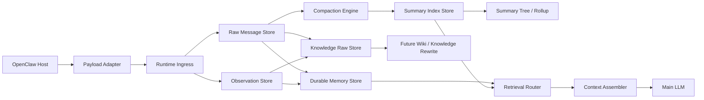

# ChaunyOMS

<div align="center">

**A production-minded context engine plugin for OpenClaw**

[](./README.md)
[](https://www.typescriptlang.org/)
[](./README.md)
[](./README.md)

</div>

> ChaunyOMS is a **runtime-first memory and context orchestration layer** for OpenClaw.  
> It is designed to stay useful before compaction, disciplined during compaction, and extensible toward future wiki-style knowledge workflows.

---

## Table of contents

- [What it is](#what-it-is)
- [What it is not](#what-it-is-not)
- [Why it matters](#why-it-matters)
- [Architecture](#architecture)
- [Memory layers](#memory-layers)
- [Current behavior](#current-behavior)
- [Install](#install)
- [Configuration](#configuration)
- [Repository map](#repository-map)
- [Validation](#validation)
- [Roadmap](#roadmap)

---

## What it is

ChaunyOMS is a **drop-in context engine plugin** for OpenClaw that focuses on:

- long-session context control
- traceable raw history
- structured durable memory
- compaction with source recall
- project-aware organization
- future-ready knowledge workflows

In practical terms, it gives OpenClaw a stronger runtime backbone for:

- **fresh-tail assembly** while conversations are still active
- **selective structure extraction** before any summary exists
- **compaction barriers** when context pressure becomes unhealthy
- **retrieval routing** across multiple memory layers

---

## What it is not

ChaunyOMS is **not**:

- a generic chat memory dump
- a finished wiki compiler
- a vector database replacement
- a magic “store everything forever” plugin

It is deliberately opinionated:

- raw history remains the source layer
- durable memory is structured but lightweight
- knowledge promotion exists but is optional
- safe defaults take priority over aggressive automation

---

## Why it matters

Many memory systems fail in one of two ways:

1. they keep injecting more and more text into the prompt, or
2. they jump too early into a heavy knowledge system without a clean runtime boundary

ChaunyOMS takes a stricter path:

- **runtime layer** and **data layer** are separated
- compaction is treated as a controlled system event, not a casual append
- structured memory can exist **before** summaries exist
- future knowledge layers can be built on top of cleaner raw material

That makes it useful for teams who want something that is:

- more serious than “just save chat logs”
- more grounded than a fully speculative memory platform

---

## Architecture



---

## Memory layers

| Layer | Purpose | Current role |
| --- | --- | --- |
| `RawMessageStore` | Source transcript layer | Fresh-tail assembly, exact recall, compaction source |
| `ObservationStore` | Tool/output observation layer | Keeps non-chat runtime signals out of raw chat |
| `DurableMemoryStore` | Structured stable memory entries | Constraints, decisions, diagnostics, project-state hints |
| `KnowledgeRawStore` | Knowledge-candidate raw material | Raw inputs for future wiki / knowledge rewrite |
| `SummaryIndexStore` | Compressed history | Leaf summaries and later rollups |
| `KnowledgeMarkdownStore` | Managed long-term knowledge docs | Present in code, disabled by default |
| `ProjectRegistryStore` | Project-aware organization layer | Active focus, blockers, next steps, linked assets |

### A useful distinction

- **Durable memory** is **not** the same thing as a compaction summary.
- Durable memory is an early structured extraction layer.
- Summaries only appear once compaction is triggered.

---

## Current behavior

### Safe defaults

- `chaunyoms` installs in **safe mode**
- tools are **off by default**
- knowledge promotion is **off by default**
- strict compaction is **on by default**

### Runtime behavior

- recent-tail assembly is the safe baseline
- runtime ingress filters host wrappers, heartbeats, pseudo-user noise, and low-value tool receipts
- durable memory and knowledge raw can be written **before compaction**
- compaction runs only when pressure crosses the configured threshold
- navigation snapshots are written only after compaction creates a new compressed boundary

### Retrieval behavior

Current routing can hard-select between:

- `recent_tail`
- `project_registry`
- `durable_memory`
- `summary_tree`
- `knowledge`
- `shared_insights`
- `vector_search`

---

## Install

## 1. Build

```powershell
npm install
npm run build
```

## 2. Link-install into OpenClaw

```powershell
openclaw plugins install -l "D:\chaunyoms"
openclaw plugins doctor
openclaw plugins list
```

## 3. Activate as the context engine

Add this under your OpenClaw config:

```json
{
  "plugins": {
    "slots": {
      "contextEngine": "chaunyoms"
    },
    "entries": {
      "chaunyoms": {
        "enabled": true,
        "config": {
          "dataDir": "C:\\openclaw-data\\data\\chaunyoms",
          "sharedDataDir": "C:\\openclaw-data",
          "memoryVaultDir": "C:\\openclaw-data\\vaults\\chaunyoms",
          "knowledgeBaseDir": "C:\\openclaw-data\\knowledge-base",
          "enableTools": false,
          "contextThreshold": 0.70,
          "strictCompaction": true,
          "compactionBarrierEnabled": true,
          "knowledgePromotionEnabled": false
        }
      }
    }
  }
}
```

Then restart:

```powershell
openclaw gateway restart
```

---

## Configuration

Important schema options:

- `dataDir`
- `workspaceDir`
- `sharedDataDir`
- `memoryVaultDir`
- `knowledgeBaseDir`
- `enableTools`
- `contextThreshold`
- `strictCompaction`
- `compactionBarrierEnabled`
- `runtimeCaptureEnabled`
- `durableMemoryEnabled`
- `autoRecallEnabled`
- `knowledgePromotionEnabled`
- `emergencyBrake`

### Notes

- plugin config belongs under `plugins.entries.chaunyoms.config`
- if `sharedDataDir` is overridden and other dirs are omitted, ChaunyOMS derives paths under that shared root
- if assembly fails, ChaunyOMS falls back to recent-tail behavior

---

## Repository map

```text
src/
  data/        data boundaries, migrations, vault bridge
  engines/     compaction, extraction, organization, summary hierarchy
  host/        OpenClaw payload/config/runtime adapters
  resolvers/   recall resolution
  routing/     retrieval route decisions
  runtime/     session runtime, ingress, retrieval service
  stores/      raw/summaries/durable/knowledge/project persistence
  system/      external shared-data bootstrap
  tests/       focused runtime/data regressions
```

---

## Validation

Current repo validation includes focused tests for:

- runtime ingress normalization
- summary normalization
- summary tree and project registry behavior
- tool turn numbering
- upgrade protection
- knowledge routing priority
- retrieval vector fallback

This is not pretending to be “done forever”, but it is also not a toy repo without guardrails.

---

## Roadmap

Near-term directions:

- stronger semantic dedupe for durable / knowledge raw layers
- asynchronous wiki rewrite pipeline
- cleaner separation between runtime memory and managed knowledge
- broader end-to-end conversation validation under real OpenClaw sessions

---

## Project positioning

The honest version:

- ChaunyOMS is still evolving.
- Some layers are already solid.
- Some layers are intentionally staged for later.

The ambitious version:

- it already looks more like a **real context engine architecture** than a simple memory patch,
- and it is being built with enough discipline that future wiki/knowledge layers can land on top of it cleanly.

