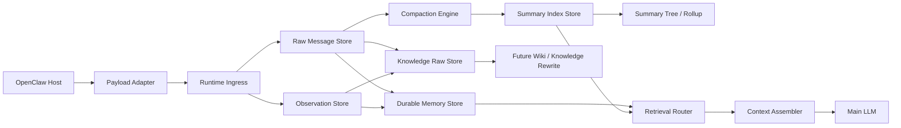

# ChaunyOMS

<div align="center">

**A production-minded context engine plugin for OpenClaw**

[](./README.md)
[](https://www.typescriptlang.org/)
[](./README.md)
[](./README.md)

</div>

> ChaunyOMS is a **runtime-first memory and context orchestration layer** for OpenClaw.  
> It is designed to stay useful before compaction, disciplined during compaction, and extensible toward future wiki-style knowledge workflows.

---

## Current architecture in one sentence

**ChaunyOMS is a SQLite-driven long-context runtime with Markdown as the long-term knowledge asset layer.**

SQLite owns runtime truth: raw messages, summaries, source edges, memories, asset index, context-run audit logs, and retrieval candidates. Markdown owns human-readable assets: decisions, patterns, facts, incidents, and reviewed notes. Runtime retrieval is raw-first for facts, asset-aware for reviewed knowledge, and always gated by ContextPlanner budget/authority rules.

Use `memory_retrieve` as the primary entrypoint. Use `oms_setup_guide`, `oms_grep`, `oms_expand`, `oms_trace`, `oms_replay`, `oms_status`, `oms_doctor`, `oms_verify`, `oms_backup`, `oms_restore`, `oms_asset_sync`, `oms_asset_reindex`, `oms_asset_verify`, `oms_inspect_context`, and `oms_why_recalled` when you need setup guidance, evidence, operations, or explainability.

---

## Provider fallback

ChaunyOMS prefers the OpenClaw host LLM caller. If the host only exposes model/provider config, the fallback caller now supports:

- `anthropic-messages`
- `openai-compatible` / `openai-chat-completions`
- `minimax` / `minimax-openai`

MiniMax can be configured through the OpenAI-compatible chat-completions shape:

```json
{
  "models": {
    "providers": {
      "minimax": {
        "api": "minimax-openai",
        "baseUrl": "https://api.minimaxi.com/v1",
        "apiKeyEnv": "MINIMAX_API_KEY"
      }
    }
  },
  "agents": {
    "defaults": {
      "model": { "primary": "minimax/MiniMax-M2.7" }
    }
  }
}
```

Use `https://api.minimax.io/v1` for international accounts and `https://api.minimaxi.com/v1` for China-region accounts.

---

## Runtime retrieval and SQLite tuning

`memory_retrieve` now keeps one ordered path: SQLite raw search narrows history candidates, source edges expand/trace evidence, and ContextPlanner is the final budget/authority gate. Context assembly also reads recent tail, active memory, summary context, and context-run audit data from SQLite first. JSON/JSONL stores are current-write mirrors and operational sidecars only; legacy schema migration is no longer part of the hot startup path. FTS/BM25 is only a fast clue finder; it does not become a separate authority layer, and DAG/source edges remain provenance infrastructure rather than a competing recall router.

SQLite defaults to conservative rollback journaling:

```json
{
  "sqliteJournalMode": "delete"
}
```

Set `sqliteJournalMode` to `"wal"` only when the host runtime benefits from concurrent read/write access and the deployment filesystem supports WAL files reliably.

Run `oms_setup_guide` after install to see the active data paths, Node `node:sqlite` adapter status, safe defaults, and the recommended knowledge-promotion/manual-review posture for the current host configuration.

Markdown assets are synchronized explicitly rather than scanned on every model turn:

- `oms_asset_sync` updates SQLite's runtime asset index from Markdown after normal edits.
- `oms_asset_reindex` rebuilds the runtime asset index from Markdown after migrations or suspected drift.
- `oms_asset_verify` checks missing files, duplicate canonical keys, stale indexes, and missing provenance.

---

## Knowledge candidate review

Knowledge promotion can stay fully automatic, or it can pause in a scored review queue before Markdown writes:

```json
{
  "knowledgePromotionEnabled": true,
  "knowledgePromotionManualReviewEnabled": true
}
```

Every accepted knowledge-raw candidate now receives:

- a <=20 character one-line summary for quick UI scanning;
- a weighted total score;
- dimension scores for value, research difficulty, source effort, content density, evidence strength, and novelty;
- a recommendation: `promote`, `review`, or `skip`.

UI/tooling entrypoints:

- `oms_knowledge_candidates` lists scored candidates.
- `oms_knowledge_review` approves/rejects a candidate.
- `oms_knowledge_curate` audits the Markdown asset layer for duplicates and missing provenance.

Automatic mode remains the default. `oms_doctor` reminds users that they can enable manual review if they want tighter control over knowledge writes.

---

## Table of contents

- [The big idea](#the-big-idea)
- [What it is](#what-it-is)
- [What it is not](#what-it-is-not)
- [Why it matters](#why-it-matters)
- [Design principles](#design-principles)
- [What happens in one turn](#what-happens-in-one-turn)
- [Architecture](#architecture)
- [Memory layers](#memory-layers)
- [Current behavior](#current-behavior)
- [Install](#install)
- [Configuration](#configuration)
- [Repository map](#repository-map)
- [Validation](#validation)
- [Roadmap](#roadmap)

---

## The big idea

ChaunyOMS is built around one belief:

> **Context, memory, and knowledge should not be collapsed into the same layer.**

Most systems eventually blur these concerns:

- raw chat gets treated like knowledge,
- summaries get treated like durable facts,
- project state gets mixed into long-term memory,
- and the prompt becomes the dumping ground for everything.

ChaunyOMS tries to resist that drift.

It is not “bigger memory.”  
It is an attempt to make a long-running OpenClaw agent behave like a system with:

- a **source layer**
- a **structured runtime memory layer**
- a **controlled compression layer**
- and a future **knowledge layer** that can be built on top without lying about provenance

---

## What it is

ChaunyOMS is a **drop-in context engine plugin** for OpenClaw that focuses on:

- long-session context control
- traceable raw history
- structured durable memory
- compaction with source recall
- project-aware organization
- future-ready knowledge workflows

In practical terms, it gives OpenClaw a stronger runtime backbone for:

- **fresh-tail assembly** while conversations are still active
- **selective structure extraction** before any summary exists
- **compaction barriers** when context pressure becomes unhealthy
- **retrieval routing** across multiple memory layers

The project is intentionally ambitious in architecture, but conservative in activation:

- it already separates runtime and data concerns,
- but it still ships with safe defaults,
- and it does not pretend unfinished wiki-style knowledge layers are already “done.”

---

## What it is not

ChaunyOMS is **not**:

- a generic chat memory dump
- a finished wiki compiler
- a vector database replacement
- a magic “store everything forever” plugin

It is deliberately opinionated:

- raw history remains the source layer
- durable memory is structured but lightweight
- knowledge promotion exists but is optional
- safe defaults take priority over aggressive automation

---

## Why it matters

Many memory systems fail in one of two ways:

1. they keep injecting more and more text into the prompt, or
2. they jump too early into a heavy knowledge system without a clean runtime boundary

ChaunyOMS takes a stricter path:

- **runtime layer** and **data layer** are separated
- compaction is treated as a controlled system event, not a casual append
- structured memory can exist **before** summaries exist
- future knowledge layers can be built on top of cleaner raw material

That makes it useful for teams who want something that is:

- more serious than “just save chat logs”
- more grounded than a fully speculative memory platform

---

## Design principles

### 1. Raw history remains the source of truth

Raw chat is not treated as disposable sludge.

It remains:

- traceable
- recallable
- compressible
- auditable

This matters because a system that cannot get back to its own source material eventually starts hallucinating confidence.

### 2. Durable memory is not the same as summary

This distinction is central.

- **Durable memory** = early structured memory entries such as constraints, decisions, diagnostics, and project-state hints.
- **Summary** = compaction output over a range of historical turns.

Durable memory exists *before* compaction.  
Summary exists *because of* compaction.

### 3. Knowledge should have a staging area

A lot of systems jump directly from chat into “knowledge.”

ChaunyOMS inserts a cleaner buffer:

- `knowledge raw`

That creates a place for:

- higher-value extracted material
- explicit remember-intent handling
- future wiki rewriting
- later reconciliation / dedupe / promotion

without pretending that every useful runtime memory is already formal knowledge.

### 4. Compaction is treated as control logic

Compaction is not just a convenience summary feature.
It is a **pressure-management mechanism**.

That means:

- context pressure is measured
- compaction can block assemble until the system is back in a healthy zone
- the fixed zone, fresh zone, and compressible zone are conceptually separated

### 5. Safe defaults are part of the architecture

The project defaults are intentionally cautious:

- tools off
- knowledge promotion off
- strict compaction on

This is not reluctance. It is operational discipline.

---

## What happens in one turn

When a normal turn arrives, the system does **not** immediately jump into heavy summarization.

Instead, the flow is roughly:

1. **Ingress filtering**
   - strip wrappers
   - reject low-value noise
   - split raw chat from observation-style signals

2. **Raw / observation persistence**
   - transcript-like content goes to raw
   - substantive tool/output signals go to observation

3. **Structured extraction**
   - durable memory entries may be created
   - knowledge-raw candidates may be created

4. **Context assembly**
   - fresh tail remains primary while history is still manageable
   - durable memory and other structured layers may assist

5. **Compaction only when necessary**
   - summaries are created only after pressure crosses the threshold
   - rollups only happen after enough summary structure exists

This is why the repo can already “do memory work” before any summary tree exists.

---

## Architecture



---

## Memory layers

| Layer | Purpose | Current role |
| --- | --- | --- |
| `RawMessageStore` | Source transcript layer | Fresh-tail assembly, exact recall, compaction source |
| `ObservationStore` | Tool/output observation layer | Keeps non-chat runtime signals out of raw chat |
| `DurableMemoryStore` | Structured stable memory entries | Constraints, decisions, diagnostics, project-state hints |
| `KnowledgeRawStore` | Knowledge-candidate raw material | Raw inputs for future wiki / knowledge rewrite |
| `SummaryIndexStore` | Compressed history | Leaf summaries and later rollups |
| `KnowledgeMarkdownStore` | Managed long-term knowledge docs | Present in code, disabled by default |
| `ProjectRegistryStore` | Project-aware organization layer | Active focus, blockers, next steps, linked assets |

### A useful distinction

- **Durable memory** is **not** the same thing as a compaction summary.
- Durable memory is an early structured extraction layer.
- Summaries only appear once compaction is triggered.

### Another useful distinction

- **Project registry** is not a knowledge layer.
- **Navigation** is not the same thing as memory content.
- **Knowledge raw** is not yet wiki.

This sounds obvious, but keeping those boundaries intact is exactly what prevents a long-running agent system from turning into an unmaintainable blob.

---

## Current behavior

### Safe defaults

- `chaunyoms` installs in **safe mode**
- tools are **off by default**
- knowledge promotion is **off by default**
- strict compaction is **on by default**

### Runtime behavior

- recent-tail assembly is the safe baseline
- runtime ingress filters host wrappers, heartbeats, pseudo-user noise, and low-value tool receipts
- durable memory and knowledge raw can be written **before compaction**
- compaction runs only when pressure crosses the configured threshold
- navigation snapshots are written only after compaction creates a new compressed boundary

In other words:

- before compaction, the system is mostly doing **capture + extraction + organization**
- after compaction, it starts doing **compression + hierarchical history management**

### Retrieval behavior

Current routing can hard-select between:

- `recent_tail`
- `project_registry`
- `durable_memory`
- `summary_tree`
- `knowledge`

---

## Install

## 1. Build

```powershell
npm install
npm run build
```

## 2. Link-install into OpenClaw

```powershell
openclaw plugins install -l "D:\chaunyoms"
openclaw plugins doctor
openclaw plugins list
```

## 3. Activate as the context engine

Add this under your OpenClaw config:

```json
{
  "plugins": {
    "slots": {
      "contextEngine": "chaunyoms"
    },
    "entries": {
      "chaunyoms": {
        "enabled": true,
        "config": {
          "dataDir": "C:\\openclaw-data\\data\\chaunyoms",
          "sharedDataDir": "C:\\openclaw-data",
          "memoryVaultDir": "C:\\openclaw-data\\vaults\\chaunyoms",
          "knowledgeBaseDir": "C:\\openclaw-data\\knowledge-base",
          "enableTools": false,
          "contextThreshold": 0.70,
          "strictCompaction": true,
          "compactionBarrierEnabled": true,
          "knowledgePromotionEnabled": false
        }
      }
    }
  }
}
```

Then restart:

```powershell
openclaw gateway restart
```

---

## Configuration

Important schema options:

- `dataDir`
- `workspaceDir`
- `sharedDataDir`
- `memoryVaultDir`
- `knowledgeBaseDir`
- `enableTools`
- `contextThreshold`
- `strictCompaction`
- `compactionBarrierEnabled`
- `runtimeCaptureEnabled`
- `durableMemoryEnabled`
- `autoRecallEnabled`
- `knowledgePromotionEnabled`
- `emergencyBrake`

### Notes

- plugin config belongs under `plugins.entries.chaunyoms.config`
- if `sharedDataDir` is overridden and other dirs are omitted, ChaunyOMS derives paths under that shared root
- if assembly fails, ChaunyOMS falls back to recent-tail behavior

---

## Repository map

```text
src/
  data/        data boundaries, migrations, vault bridge
  engines/     compaction, extraction, organization, summary hierarchy
  host/        OpenClaw payload/config/runtime adapters
  resolvers/   recall resolution
  routing/     retrieval route decisions
  runtime/     session runtime, ingress, retrieval service
  stores/      raw/summaries/durable/knowledge/project persistence
  system/      shared-data bootstrap
  tests/       focused runtime/data regressions
```

---

## Validation

Current repo validation includes focused tests for:

- runtime ingress normalization
- summary normalization
- summary tree and project registry behavior
- tool turn numbering
- upgrade protection
- knowledge routing priority
- retrieval vector fallback

This is not pretending to be “done forever”, but it is also not a toy repo without guardrails.

---

## Roadmap

Near-term directions:

- stronger semantic dedupe for durable / knowledge raw layers
- asynchronous wiki rewrite pipeline
- cleaner separation between runtime memory and unified knowledge
- broader end-to-end conversation validation under real OpenClaw sessions

---

## Project positioning

The honest version:

- ChaunyOMS is still evolving.
- Some layers are already solid.
- Some layers are intentionally staged for later.

The ambitious version:

- it already looks more like a **real context engine architecture** than a simple memory patch,
- and it is being built with enough discipline that future wiki/knowledge layers can land on top of it cleanly.

If you want the shortest honest pitch:

> ChaunyOMS is trying to be the kind of memory/context engine you can keep growing for a long time without regretting the first layer.
