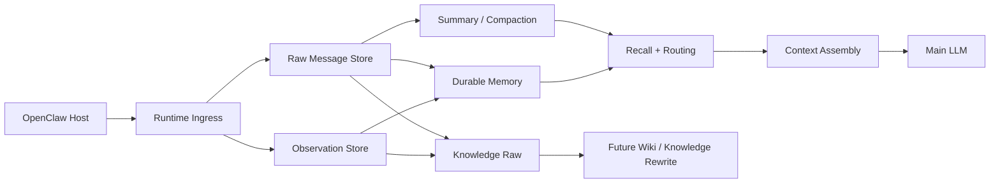

# ChaunyOMS

<div align="center">

**An authoritative memory + contextEngine substrate plugin for OpenClaw**
**一个面向真实长会话与长期记忆治理的 OpenClaw 上下文引擎插件**

[](https://github.com/Chaunyzhang/chaunyoms)
[](https://www.typescriptlang.org/)
[](https://github.com/Chaunyzhang/chaunyoms)
[](https://github.com/Chaunyzhang/chaunyoms)

</div>

---

## Current architecture in one sentence

**ChaunyOMS is a SQLite-driven OpenClaw memory + contextEngine substrate. Markdown is export-only, never the runtime fact source.**

SQLite owns runtime truth: Source/raw messages, BaseSummary, MemoryItem, source edges, asset indexes, context-run audit logs, and retrieval candidates. `MEMORY.md`, daily notes, `DREAMS.md`, and Obsidian/knowledge Markdown are human-readable exports or migration/debug artifacts only; they are not scanned on every turn and do not feed authoritative recall. Runtime retrieval is source-first, MemoryItem/BaseSummary-backed, and always gated by ContextPlanner budget/authority rules.

Use `memory_retrieve` as the primary OMS entrypoint and the OpenClaw-compatible `memory_search` / `memory_get` facades when the host expects native memory tools. Use `oms_setup_guide`, `oms_grep`, `oms_expand`, `oms_trace`, `oms_replay`, `oms_status`, `oms_doctor`, `oms_verify`, `oms_backup`, `oms_restore`, `oms_asset_sync`, `oms_asset_reindex`, `oms_asset_verify`, `oms_inspect_context`, `oms_why_recalled`, and `oms_planner_debug` when you need setup guidance, evidence, operations, or explainability.

---

## Provider fallback

The runtime prefers OpenClaw's host LLM caller. If only provider config is available, fallback summary/promotion calls support Anthropic Messages and OpenAI-compatible chat completions, including MiniMax:

```json
{
  "models": {
    "providers": {
      "minimax": {
        "api": "minimax-openai",
        "baseUrl": "https://api.minimaxi.com/v1",
        "apiKeyEnv": "MINIMAX_API_KEY"
      }
    }
  },
  "agents": {
    "defaults": {
      "model": { "primary": "minimax/MiniMax-M2.7" }
    }
  }
}
```

International MiniMax base URL: `https://api.minimax.io/v1`; China-region base URL: `https://api.minimaxi.com/v1`.

---

## Runtime retrieval and SQLite tuning

`memory_retrieve` now keeps one ordered path: SQLite raw search narrows history candidates, source edges expand/trace evidence, and ContextPlanner is the final budget/authority gate. Context assembly also reads recent tail, active memory, summary context, and context-run audit data from SQLite first. JSON/JSONL stores are current-write mirrors and operational sidecars only; legacy schema migration is no longer part of the hot startup path. FTS/BM25 is only a fast clue finder; it does not become a separate authority layer, and DAG/source edges remain provenance infrastructure rather than a competing recall router.

LLMPlanner is the on-demand scheduling brain for ambiguous, source-sensitive, cross-layer, or memory-write-risk retrieval. It classifies intent, plans progressive layers, proposes context budgets and stop conditions, then hands execution to the existing router/runtime/ContextPlanner stack. PlanValidator and RetrievalVerifier keep the hard boundaries: Markdown is never a runtime fact source, tool output is never Source, strict requires verified source evidence, and forensic requires complete raw trace.

Planner controls:

```json
{
  "llmPlannerMode": "auto",
  "plannerDebugEnabled": false,
  "llmPlannerModel": "optional-host-model-name"
}
```

Use `llmPlannerMode: "off"` for deterministic-only operation, `"shadow"` to keep deterministic selection while recording planner diagnostics, and `"auto"` to let accepted planner plans become the retrieval schedule. Use `oms_planner_debug` to compare planner intent, deterministic route, selected plan, validation, fallback, and route steps for a query.

SQLite defaults to conservative rollback journaling:

```json
{
  "sqliteJournalMode": "delete"
}
```

Set `sqliteJournalMode` to `"wal"` only when the host runtime benefits from concurrent read/write access and the deployment filesystem supports WAL files reliably.

Run `oms_setup_guide` after install to see the active data paths, Node `node:sqlite` adapter status, safe defaults, and the recommended knowledge-promotion/manual-review posture for the current host configuration.

Markdown assets are explicit export/index artifacts, not hot-path memory. When you opt into maintaining them, synchronize them deliberately:

- `oms_asset_sync` updates SQLite's runtime asset index from Markdown after normal edits.
- `oms_asset_reindex` rebuilds the runtime asset index from Markdown after migrations or suspected drift.
- `oms_asset_verify` checks missing files, duplicate canonical keys, stale indexes, and missing provenance.

---

## Knowledge candidate review

Knowledge promotion is review-first by default in the final shape. If you opt into Markdown export writes, candidates can pause in a scored review queue before any export:

```json
{
  "knowledgePromotionEnabled": true,
  "knowledgePromotionManualReviewEnabled": true
}
```

Each accepted knowledge-raw candidate gets a <=20 character one-line summary, weighted total score, dimension scores for value / research difficulty / source effort / content density / evidence strength / novelty, and a recommendation: `promote`, `review`, or `skip`.

UI/tooling entrypoints: `oms_knowledge_candidates`, `oms_knowledge_review`, `oms_knowledge_curate`. Automatic mode remains the default; `oms_doctor` reminds users they can enable manual review for tighter control.

---

## Language / 语言

- [English README](./README.en.md)
- [中文说明](./README.zh-CN.md)

---

## At a glance

ChaunyOMS is a **drop-in context engine** for OpenClaw focused on long conversations, structured memory layers, controlled compaction, and future-ready knowledge workflows.

ChaunyOMS 是一个给 OpenClaw 用的 **上下文引擎插件**，重点解决：

- 长对话上下文膨胀
- 原始记录、长期记忆、知识原料的分层
- 可控压缩与回溯
- 面向后续 wiki / knowledge workflow 的演进空间

它想做的不是“多存一点”，而是把这三件事同时做好：

1. **当前对话仍然流畅可用**
2. **历史不会无限膨胀失控**
3. **未来知识层建立在干净原料上**

---

## Why this repo exists

Most “memory” plugins either:

- only append more text to the prompt, or
- jump straight to a full knowledge system without a clean runtime/data boundary.

ChaunyOMS takes a stricter route:

- **raw conversation stays traceable**
- **durable memory stays structured**
- **knowledge workflows stay optional**
- **safe defaults come first**

它不是“多塞一点记忆进 prompt”的小补丁，
也不是一开始就把所有东西揉成一个知识库的大一统方案。

它更像一套**克制但有野心**的内核：

- 先把运行期上下文做好
- 再把数据边界理顺
- 再把知识层往上建

换句话说，ChaunyOMS 的核心不是“记忆更多”，而是：

> **让上下文、记忆、知识三者各守其职。**

---

## Core ideas

### 1. Raw is the source layer

原始对话不是垃圾，也不是应该立刻抹平的中间态。
它是：

- source of truth
- 精确回溯依据
- compaction 的来源
- 后续知识抽取的底稿

### 2. Durable memory is not summary

`durable memory` 不是“把一段历史压成一段总结”。
它更像：

- 结构化长期记忆卡片
- 提前抽出的约束 / 决策 / 诊断 / 项目状态
- 在 summary 还没出现之前就能工作的稳定层

### 3. Knowledge raw is the bridge to future wiki

不是所有 durable memory 都该直接变成正式知识。
所以 ChaunyOMS 单独切出一层：

- `knowledge raw`

它的作用是：

- 把值得长期治理的材料先沉下来
- 但暂时不假装它已经是 wiki / formal knowledge

### 4. Compaction is a control system, not a convenience feature

很多系统把压缩当成“顺手摘要一下”。
ChaunyOMS 更像把它当成：

- 上下文压力控制机制
- 明确的生命周期事件
- 有边界、有恢复目标的系统动作

### 5. Safe defaults matter

它默认不开一堆很激进的东西：

- tools 默认关
- knowledge promotion 默认关
- strict compaction 默认开

这不是保守，而是工程判断：

> 先保证系统不乱，再逐层打开能力。

---

## Architecture snapshot



---

## Current repo status

### Already working

- OpenClaw context-engine lifecycle integration
- runtime message ingress filtering
- raw / durable / knowledge-raw persistence
- structured compaction pipeline
- summary tree rollup path
- project registry organization
- unified knowledge promotion path in code
- retrieval routing across recent tail / project registry / durable memory / summary tree / knowledge / vector fallback

### Safe by default

- tools disabled by default
- knowledge promotion disabled by default
- strict compaction enabled by default
- runtime data stored outside the gateway working directory

### Still evolving

- wiki rewrite layer
- stronger semantic dedupe / reconciliation
- broader real-world conversation validation

---

## What makes it different

和普通“memory plugin”相比，ChaunyOMS 的区别不在于它多了几个 store，
而在于它把问题拆成了不同层次：

| 问题 | 常见做法 | ChaunyOMS 的做法 |
| --- | --- | --- |
| 会话变长 | 往 prompt 里继续塞 | recent tail + structured layers + compaction barrier |
| 重要信息沉淀 | 聊天记录里自己找 | durable memory / project registry / knowledge raw |
| 历史压缩 | 随便总结一下 | 明确 compaction pipeline + source recall |
| 知识体系 | 直接把聊天变 wiki | 先 raw，再 structured memory，再 knowledge raw，再往 wiki 走 |

所以它真正想做的是：

> **把“正在聊天的系统”和“长期成长的系统”分开。**

---

## Read more

- [English README](./README.en.md) — architecture, install, behavior, boundaries
- [中文说明](./README.zh-CN.md) — 中文版完整介绍、安装和设计说明
