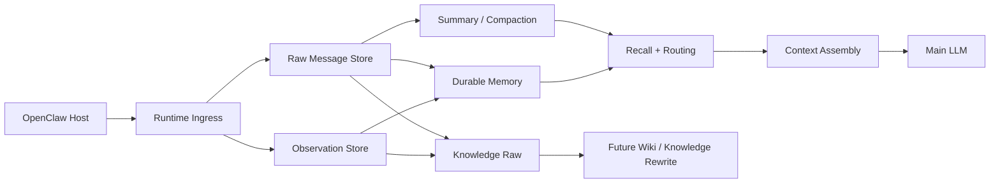

# ChaunyOMS

**A production-minded context engine plugin for OpenClaw**  
**一个面向真实长会话与长期记忆治理的 OpenClaw 上下文引擎插件**

---

## Language / 语言

- [English README](./README.en.md)
- [中文说明](./README.zh-CN.md)

---

## At a glance

ChaunyOMS is a **drop-in context engine** for OpenClaw focused on long conversations, structured memory layers, controlled compaction, and future-ready knowledge workflows.

ChaunyOMS 是一个给 OpenClaw 用的 **上下文引擎插件**，重点解决：

- 长对话上下文膨胀
- 原始记录、长期记忆、知识原料的分层
- 可控压缩与回溯
- 面向后续 wiki / knowledge workflow 的演进空间

---

## Why this repo exists

Most “memory” plugins either:

- only append more text to the prompt, or
- jump straight to a full knowledge system without a clean runtime/data boundary.

ChaunyOMS takes a stricter route:

- **raw conversation stays traceable**
- **durable memory stays structured**
- **knowledge workflows stay optional**
- **safe defaults come first**

它不是“多塞一点记忆进 prompt”的小补丁，  
也不是一开始就把所有东西揉成一个知识库的大一统方案。

它更像一套**克制但有野心**的内核：

- 先把运行期上下文做好
- 再把数据边界理顺
- 再把知识层往上建

---

## Architecture snapshot

---

## Current repo status

### Already working

- OpenClaw context-engine lifecycle integration
- runtime message ingress filtering
- raw / durable / knowledge-raw persistence
- structured compaction pipeline
- summary tree rollup path
- project registry organization
- managed knowledge promotion path in code
- retrieval routing across recent tail / project registry / durable memory / summary tree / knowledge / vector fallback

### Safe by default

- tools disabled by default
- knowledge promotion disabled by default
- strict compaction enabled by default
- runtime data stored outside the gateway working directory

### Still evolving

- wiki rewrite layer
- stronger semantic dedupe / reconciliation
- broader real-world conversation validation

---

## Read more

- [English README](./README.en.md) — architecture, install, behavior, boundaries
- [中文说明](./README.zh-CN.md) — 中文版完整介绍、安装和设计说明

