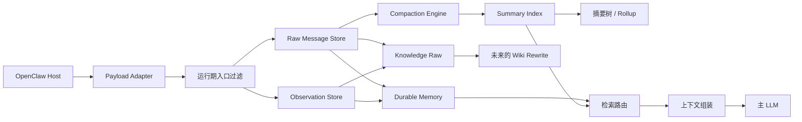

# ChaunyOMS

<div align="center">

**一个面向真实长会话与长期记忆治理的 OpenClaw 上下文引擎插件**

[](./README.md)
[](https://www.typescriptlang.org/)
[](./README.md)
[](./README.md)

</div>

> ChaunyOMS 不是“给 prompt 多塞一点记忆”的补丁，  
> 也不是一上来就把所有东西揉成一个巨型知识库的激进方案。  
> 它更像一个**运行期优先、边界清晰、可继续长大的上下文内核**。

---

## Current architecture in one sentence

**ChaunyOMS is a SQLite-driven long-context runtime with Markdown as the long-term knowledge asset layer.**

SQLite owns runtime truth: raw messages, summaries, source_edges, memories, asset index, context_runs, and retrieval_candidates. Markdown owns human-readable assets. For factual history, this agent's raw ledger has priority; reviewed knowledge is advisory; ContextPlanner is the only gate that decides what enters context.

Primary path: `memory_retrieve`. Setup/evidence/ops path: `oms_setup_guide`, `oms_grep`, `oms_expand`, `oms_trace`, `oms_replay`, `oms_status`, `oms_doctor`, `oms_verify`, `oms_backup`, `oms_restore`, `oms_asset_sync`, `oms_asset_reindex`, `oms_asset_verify`, `oms_inspect_context`, `oms_why_recalled`.

---

## 目录

- [核心想法](#核心想法)
- [它是什么](#它是什么)
- [它不是什么](#它不是什么)
- [为什么值得做](#为什么值得做)
- [设计原则](#设计原则)
- [一轮对话里到底发生了什么](#一轮对话里到底发生了什么)
- [架构概览](#架构概览)
- [记忆分层](#记忆分层)
- [当前行为](#当前行为)
- [安装方式](#安装方式)
- [配置要点](#配置要点)
- [仓库结构](#仓库结构)
- [验证覆盖](#验证覆盖)
- [后续方向](#后续方向)

---

## 核心想法

ChaunyOMS 想坚持的一件事是：

> **上下文、记忆、知识，不应该被揉成同一层。**

很多系统最后都会慢慢变成这样：

- raw chat 被当知识
- summary 被当长期事实
- 项目状态被混进长期记忆
- prompt 变成所有东西的垃圾场

ChaunyOMS 想尽量避免这种塌陷。

它不是“记得更多”这么简单，  
而是想把 OpenClaw 长会话系统拆成几个职责明确的层：

- **来源层**
- **结构化运行期记忆层**
- **可控压缩层**
- **未来可演进的知识层**

这样以后你往上长 wiki / formal knowledge 的时候，不至于发现地基一开始就是糊的。

---

## 它是什么

ChaunyOMS 是一个给 OpenClaw 用的 **context engine 插件**，核心关注点是：

- 长对话上下文控制
- 可追溯的原始历史
- 结构化长期记忆
- 可控压缩与原文回溯
- 项目级组织
- 面向后续 wiki / knowledge workflow 的演进能力

更直白一点说，它想解决的是：

- 会话一长，prompt 越来越贵
- 重要信息散落在对话里，越来越难回忆
- 想做长期知识，但又不想一开始就把系统做得很重

它已经不是一个“保存聊天记录”的小插件了，  
而是在往一个**真正的上下文引擎骨架**发展。

---

## 它不是什么

ChaunyOMS **不是**：

- 一个简单的聊天日志堆积器
- 一个已经完成的 wiki 编译器
- 一个向量数据库替代品
- 一个“所有东西都先存再说”的无限记忆插件

它是有边界感的：

- raw history 仍然是来源层
- durable memory 是结构化记忆，不是摘要块
- knowledge workflow 是预留出来的，不是默认强开
- 安全默认值优先于激进自动化

它不追求“什么都能做”，  
它追求的是：

> **每一层做自己该做的事。**

---

## 为什么值得做

很多 memory 系统最后会走向两个极端：

1. 只是不断把更多文本塞回 prompt  
2. 还没把运行期问题理顺，就过早跳进一个很重的知识系统

ChaunyOMS 选的是第三条路：

- **先把运行期上下文做好**
- **再把数据边界理顺**
- **再给知识层留出干净入口**

所以它的价值不在于“功能堆很多”，而在于：

- 原始记录可追溯
- 运行层和数据层分开
- 压缩不是乱压，而是可控系统行为
- 在 summary 还没出现前，系统也能先提炼 durable / knowledge raw

这件事看起来没那么花哨，但它很关键：

> **真正能长期维护的 agent memory system，靠的不是“记很多”，而是“边界清楚”。**

---

## 设计原则

### 1. Raw history 仍然是来源层

原始对话不是立刻应该抹掉的噪音。

它是：

- 最真实的来源
- 精确回溯依据
- compaction 的输入
- 后续知识抽取的底稿

一个系统如果连自己的原文都回不去，后面就很容易变成“自信地记错”。

### 2. Durable memory 不是摘要

这点特别重要。

- **Durable memory**：提前抽出来的结构化长期记忆项  
  比如约束、决策、诊断、项目状态提示
- **Summary**：压缩触发后，对一段历史做的摘要

所以 durable memory 可以在 **还没压缩** 的时候就存在。  
而 summary 必须等 compaction 触发后才出现。

### 3. 知识应该有一个毛坯层

很多系统会直接从聊天跳到“知识库”。

ChaunyOMS 中间单独切出一层：

- `knowledge raw`

它的意义是：

- 先把值得长期治理的材料沉下来
- 但不假装它已经是 wiki / formal knowledge
- 给后续 rewrite / reconcile / promotion 留空间

### 4. Compaction 是控制逻辑，不只是顺手总结

ChaunyOMS 里，压缩不是“顺便摘要一下”。

它更像：

- 上下文压力控制机制
- 明确的生命周期事件
- 有健康区、固定区、可压缩区概念的系统动作

### 5. 安全默认值本身就是架构的一部分

当前默认策略是比较克制的：

- tools 默认关
- knowledge promotion 默认关
- strict compaction 默认开

这不是怂，而是工程判断：

> 先保证系统不乱，再逐层打开能力。

---

## 一轮对话里到底发生了什么

正常一轮对话进来时，系统不是立刻跳进重型总结。

它大概会按这个顺序走：

1. **入口过滤**
   - 去 wrapper
   - 去 heartbeat
   - 去 pseudo-user
   - 把原始聊天和 observation 类信号分开

2. **写入原始层**
   - 对话原文进 raw
   - tool / output 类信号进 observation

3. **做结构化提炼**
   - 提炼 durable memory
   - 提炼 knowledge raw 候选

4. **组装当前上下文**
   - 还没压缩时，以 recent tail 为主
   - structured layer 作为辅助

5. **只有必要时才压缩**
   - 历史压力过阈值才触发 compaction
   - 摘要足够多以后，才会继续长成摘要树

所以它现在的真实运行逻辑是：

- 压缩前：**记录 + 提炼 + 组织**
- 压缩后：**压缩 + 分层历史管理**

---

## 架构概览



---

## 记忆分层

| 层 | 作用 | 当前定位 |
| --- | --- | --- |
| `RawMessageStore` | 原始对话层 | recent tail、精确回溯、压缩来源 |
| `ObservationStore` | 观察事件层 | 把 tool/output 等运行信号从聊天原文里分出来 |
| `DurableMemoryStore` | 结构化长期记忆层 | 约束、决策、诊断、项目状态提示 |
| `KnowledgeRawStore` | 知识原料层 | 后续 wiki / knowledge rewrite 的毛坯料 |
| `SummaryIndexStore` | 压缩历史层 | 一层摘要与后续摘要树 |
| `KnowledgeMarkdownStore` | 托管知识层 | 代码已存在，默认关闭 |
| `ProjectRegistryStore` | 项目组织层 | 当前焦点、阻塞、下一步、关联资产 |

### 一个很重要的区分

- **Durable memory 不是摘要。**
- 它更像“提前抽出来的结构化长期记忆卡片”。
- 真正的“压缩摘要”要等 compaction 触发后才会出现。

### 另一个很重要的区分

- `project registry` 不是知识层
- `navigation` 不是记忆内容本体
- `knowledge raw` 也还不是 wiki

这些层如果混掉了，系统最后就会越来越像一锅粥。

---

## 当前行为

### 默认是安全模式

- tools 默认关闭
- knowledge promotion 默认关闭
- strict compaction 默认开启
- 数据目录不再跟着 gateway 工作目录乱跑

### 运行期行为

- recent-tail 仍然是最稳的基础路径
- runtime ingress 会过滤 host wrapper、heartbeat、pseudo-user 噪音、低价值 tool receipt
- 即使还没触发压缩，也可以先写：
  - raw
  - durable memory
  - knowledge raw
- 只有上下文压力过阈值时，才触发 compaction
- navigation snapshot 只有在压缩边界出现后才写

所以目前这套系统在未压缩阶段，更偏：

- **持续记录**
- **提前提炼**
- **后台组织**

而不是一上来就做重型总结。

### 检索行为

当前检索路由可以在这些层之间做硬选择：

- `recent_tail`
- `project_registry`
- `durable_memory`
- `summary_tree`
- `knowledge`

---

## 安装方式

## 1. 构建

```powershell
npm install
npm run build
```

## 2. 链接安装到 OpenClaw

```powershell
openclaw plugins install -l "D:\chaunyoms"
openclaw plugins doctor
openclaw plugins list
```

安装后先跑 `oms_setup_guide` 和 `oms_doctor`：前者告诉你当前 dataDir / knowledgeBaseDir / node:sqlite / knowledge promotion 手动审核姿态是否合适，后者检查 SQLite、source_edges、配置和知识资产健康度。

Markdown 知识资产不会每轮热路径扫文件；手动改完知识库后用 `oms_asset_sync` 同步进 SQLite 运行索引，迁移或怀疑索引漂移时用 `oms_asset_reindex` 重建，发布/排障前用 `oms_asset_verify` 查缺文件、重复 canonical key、索引过期和缺 provenance。

## 3. 激活为 context engine

在 OpenClaw 配置里加：

```json
{
  "plugins": {
    "slots": {
      "contextEngine": "chaunyoms"
    },
    "entries": {
      "chaunyoms": {
        "enabled": true,
        "config": {
          "dataDir": "C:\\openclaw-data\\data\\chaunyoms",
          "sharedDataDir": "C:\\openclaw-data",
          "memoryVaultDir": "C:\\openclaw-data\\vaults\\chaunyoms",
          "knowledgeBaseDir": "C:\\openclaw-data\\knowledge-base",
          "enableTools": false,
          "contextThreshold": 0.70,
          "strictCompaction": true,
          "compactionBarrierEnabled": true,
          "knowledgePromotionEnabled": false
        }
      }
    }
  }
}
```

然后重启：

```powershell
openclaw gateway restart
```

---

## 配置要点

重点配置项：

- `dataDir`
- `workspaceDir`
- `sharedDataDir`
- `memoryVaultDir`
- `knowledgeBaseDir`
- `enableTools`
- `contextThreshold`
- `strictCompaction`
- `compactionBarrierEnabled`
- `runtimeCaptureEnabled`
- `durableMemoryEnabled`
- `autoRecallEnabled`
- `knowledgePromotionEnabled`
- `emergencyBrake`

### 说明

- 配置必须放在 `plugins.entries.chaunyoms.config`
- 如果只改了 `sharedDataDir`，其它目录会按这个根自动推导
- 如果 assemble 失败，会回退到 recent-tail 行为

---

## 仓库结构

```text
src/
  data/        数据边界、迁移、vault bridge
  engines/     压缩、提炼、组织、摘要树
  host/        OpenClaw payload/config/runtime 适配
  resolvers/   recall 解析
  routing/     检索路由决策
  runtime/     session runtime、ingress、retrieval service
  stores/      raw/summaries/durable/knowledge/project 持久化
  system/      共享数据目录初始化
  tests/       运行期与数据边界回归测试
```

---

## 验证覆盖

当前仓库已经有针对这些点的专项测试：

- runtime ingress normalization
- summary normalization
- summary tree / project registry
- tool turn numbering
- upgrade protection
- knowledge routing priority
- retrieval vector fallback

它当然还在进化中，  
但它也已经不是一个“没有护栏、全靠感觉”的实验仓库。

---

## 后续方向

短期内最值得继续做的事情：

- durable / knowledge raw 的更强语义去重
- 把 wiki rewrite 做成异步流水线
- 继续分清运行期记忆和正式知识层
- 做更多真实 OpenClaw 会话下的 end-to-end 验证

---

## 项目定位

实话实说版本：

- 它还在长。
- 有些层已经很稳。
- 有些层是明确留到后面再做重活。

但如果要一句更有劲的话来形容它：

> **ChaunyOMS 已经不像一个“记忆小补丁”，而更像一个真正的上下文引擎骨架。**

它现在最牛的地方，不是“把所有东西都做完了”，  
而是它已经把未来能不能继续长大这件事，提前按工程方式想清楚了。

如果要再压成一句最短介绍，我会这么写：

> **ChaunyOMS 不是为了“让代理多记一点”，而是为了让长会话代理系统在未来还能继续长，而不把自己搞乱。**
