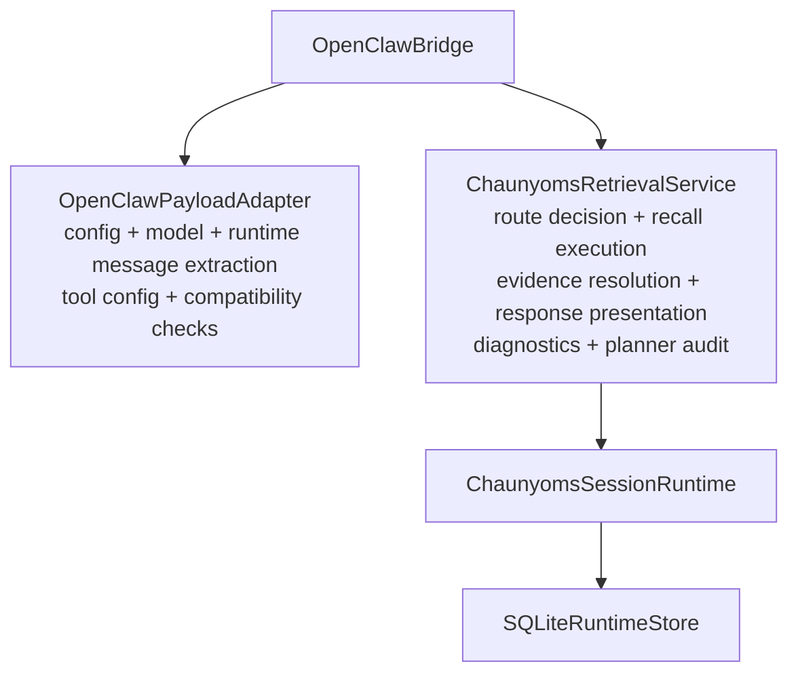
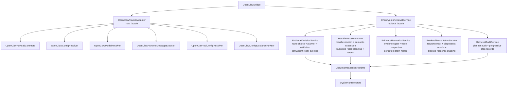
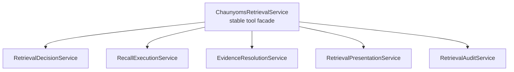

# OMS Decoupling Current Structure

## Purpose

This document shows the current architectural shape during the OMS decoupling refactor.

It is intentionally simple:

- keep outer layers easy to scan
- show what has already been extracted
- show what is still concentrated in facade-heavy files

## Layer Rule

Preferred hierarchy:

1. external entrypoints stay small
2. facades delegate inward
3. policy / routing logic sits behind focused services
4. runtime and storage stay below the orchestration layer

## Before

### Before Summary

- `OpenClawPayloadAdapter` carried most host-facing concerns in one file.
- `ChaunyomsRetrievalService` carried most retrieval concerns in one file.
- facades and internal policy logic were too mixed together.

## Current

## Current Layer Map

### External Entry Layer

- `OpenClawBridge`

### Host Adapter Layer

- `OpenClawPayloadAdapter`
- `OpenClawPayloadContracts`
- `OpenClawConfigResolver`
- `OpenClawModelResolver`
- `OpenClawRuntimeMessageExtractor`
- `OpenClawToolConfigResolver`
- `OpenClawConfigGuidanceAdvisor`

### Retrieval Layer

- `ChaunyomsRetrievalService`
- `RetrievalDecisionService`
- `RecallExecutionService`
- `EvidenceResolutionService`
- `RetrievalPresentationService`
- `RetrievalAuditService`

### Runtime / Storage Layer

- `ChaunyomsSessionRuntime`
- `SQLiteRuntimeStore`

## What Is Already Cleaner

### Host Adapter

- host payload parsing still enters through one facade
- config resolution is no longer embedded inline
- model resolution is no longer embedded inline
- runtime message extraction is no longer embedded inline
- tool enablement resolution is no longer embedded inline

### Retrieval

- route decision is no longer embedded inline in the main retrieval facade
- planner interaction and validation handoff now live behind `RetrievalDecisionService`
- lightweight recall route override is grouped with route decision instead of being scattered
- recall execution and semantic expansion are no longer embedded inline
- evidence gate and persistent atom merge are no longer embedded inline
- response formatting and diagnostics shaping are no longer embedded inline
- planner audit persistence is no longer embedded inline

## What Is Still Too Concentrated

The main remaining concentration point is still `ChaunyomsRetrievalService`.

It is much smaller now, but it still owns:

- stable tool entrypoints
- argument normalization
- compatibility shims kept for current tests / callers
- some remaining retrieval helper methods that can still be pushed downward later

## Recommended Next Shape

The next clean split should keep the same layer map, but continue shrinking the facade by moving the remaining helper-heavy internals behind the already-created services.

## Status

- Step 1 host-adapter extraction: functionally in place
- Step 2 retrieval extraction: functionally in place
- remaining work: keep shrinking facade helper surface without widening the public tool surface
